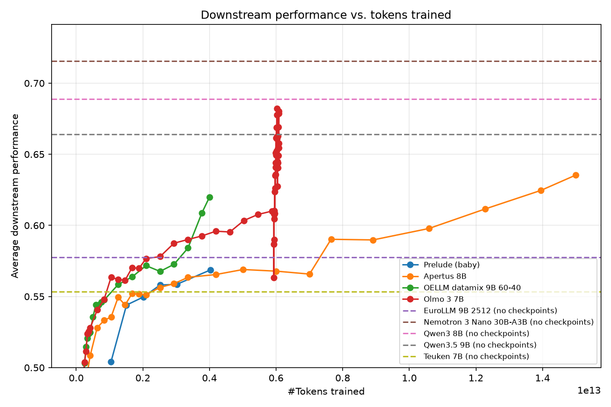

# Prelude temporary evaluations

> This code compares prelude model with evaluations from https://huggingface.co/spaces/ellamind/base-eval
> Results should be taken with a grain of salt as different transformers version were used from ellamind.
> This can cause some small variations, we will update the results with evaluations as soon as we have
> rerun the baselines.

## How to run

1. Download the two data files locally into this directory:
   - [`eval_results_baby_all.csv`](https://github.com/OpenEuroLLM/dense_multilingual_models_scaling_results/blob/main/results/downstream/eval_results_baby_all.csv)
   - [`scores.parquet`](https://huggingface.co/datasets/ellamind/eval-scores-ref/blob/main/scores.parquet)
2. Install dependencies and run the comparison script:

```bash
uv sync
uv run python compare_prelude_ellamind_suite.py
```

This prints the task-resolution log (which baby tasks were matched to which
`scores.parquet` tasks, and which were dropped because they aren't in that
suite), then writes the full comparison table to
`compare_prelude_ellamind_suite.csv`.

To generate the tokens-trained plot and the latest-checkpoint table shown
below:

```bash
uv run python -c "from compare_prelude_ellamind_suite import plot_iteration, latest_iteration_table; plot_iteration(); print(latest_iteration_table())"
```

`plot_iteration()` writes `iteration_plot.pdf`. `latest_iteration_table()`
returns a benchmark x model table using only the latest available checkpoint
per model.

## Downstream performance vs. tokens trained



## Results (latest checkpoint per model, sorted by average)

Note that the prelude model has only been trained for 4 trillions tokens and not been annealed (which usually leads to large downstream performance gain) as the model is still being trained.

| model | agieval_lsat_ar | arc_challenge | arc_easy | coqa | gsm8k | hellaswag | jeopardy | lambada_openai | mbpp | mmlu | piqa | social_iqa | squadv2 | winogrande | average |
|---|---|---|---|---|---|---|---|---|---|---|---|---|---|---|---|
| Nemotron 3 Nano 30B-A3B | 0.19 | 0.67 | 0.90 | 0.79 | 0.86 | 0.86 | 0.70 | 0.49 | 0.68 | 0.80 | 0.85 | 0.50 | 0.94 | 0.80 | 0.72 |
| Qwen3 8B | 0.20 | 0.67 | 0.88 | 0.73 | 0.84 | 0.80 | 0.58 | 0.48 | 0.68 | 0.79 | 0.82 | 0.52 | 0.89 | 0.75 | 0.69 |
| Olmo 3 7B | 0.22 | 0.60 | 0.87 | 0.86 | 0.76 | 0.76 | 0.53 | 0.46 | 0.48 | 0.68 | 0.79 | 0.55 | 0.93 | 0.73 | 0.66 |
| Qwen3.5 9B | 0.23 | 0.66 | 0.89 | 0.31 | 0.84 | 0.82 | 0.58 | 0.60 | 0.61 | 0.82 | 0.82 | 0.47 | 0.91 | 0.74 | 0.66 |
| Apertus 8B | 0.17 | 0.63 | 0.87 | 0.82 | 0.48 | 0.80 | 0.64 | 0.50 | 0.36 | 0.66 | 0.82 | 0.49 | 0.89 | 0.77 | 0.64 |
| OELLM datamix 9B 60-40 | 0.19 | 0.59 | 0.85 | 0.78 | 0.37 | 0.82 | 0.63 | 0.60 | 0.29 | 0.65 | 0.82 | 0.46 | 0.87 | 0.75 | 0.62 |
| EuroLLM 9B 2512 | 0.22 | 0.58 | 0.86 | 0.68 | 0.00 | 0.77 | 0.56 | 0.56 | 0.36 | 0.59 | 0.80 | 0.51 | 0.86 | 0.72 | 0.58 |
| Prelude (baby) | 0.24 | 0.58 | 0.84 | 0.80 | 0.31 | 0.78 | 0.49 | 0.70 | 0.27 | 0.58 | 0.81 | 0.46 | 0.37 | 0.71 | 0.57 |
| Teuken 7B | 0.19 | 0.52 | 0.78 | 0.76 | 0.12 | 0.77 | 0.56 | 0.52 | 0.22 | 0.52 | 0.79 | 0.46 | 0.81 | 0.72 | 0.55 |
| Salamandra 7B | 0.22 | 0.56 | 0.84 | 0.60 | 0.10 | 0.77 | 0.49 | 0.14 | 0.08 | 0.49 | 0.80 | 0.46 | 0.62 | 0.72 | 0.49 |
